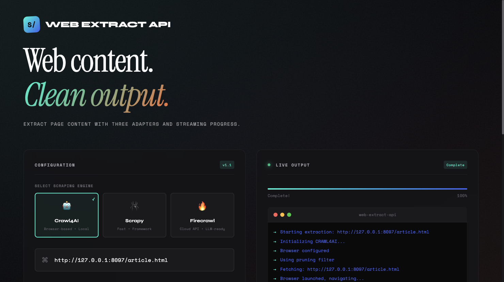
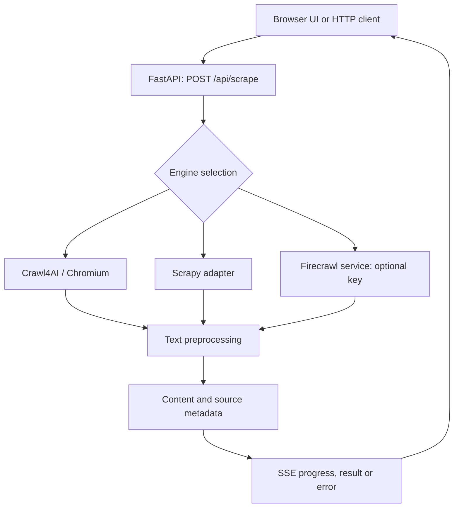

# Web Extract API

A FastAPI service and browser interface for extracting cleaned page content with streaming progress.

Web Extract API provides one request format for three extraction backends: Crawl4AI, Scrapy, and optional Firecrawl. It is a compact example of browser-backed extraction, interchangeable adapters, text preprocessing, and server-sent events for long-running requests.

**Status:** development tool. Engine behavior depends on the target page, installed browser dependencies, and provider access; extraction quality and availability are not guaranteed.



*Actual local extraction of the included example page. Previously named SCRAPE — Neural Extraction Engine. The former hosted URL is unavailable; run the service locally.*

[Quick start](#quick-start) · [Architecture](#architecture) · [API example](#api-example) · [Code guide](#code-guide)

## Capabilities

- Select an extraction engine per request.
- Configure JavaScript waits, scrolling, and supported content-selection options.
- Remove links, images, navigation text, and excess whitespace from extracted content.
- Stream progress and either a result or error through an SSE response.
- Return source URL, title, cleaned text, word count, timestamp, and engine metadata.

Options are implemented differently across adapters. JavaScript rendering and BM25 filtering belong to the Crawl4AI path; selecting another engine does not imply identical support.

## Architecture



The HTTP API is implemented in one Python module. A separate batch script collects source-attributed documents for a domain-specific dataset workflow.

## Quick start

Use Python 3.11 and install Chromium for browser-backed extraction:

```bash
git clone https://github.com/anudeepadi/web-extract-api.git
cd web-extract-api
python3 -m venv .venv
source .venv/bin/activate
python -m pip install -r requirements.txt
python -m playwright install chromium
python -m uvicorn scraper_api:app --host 127.0.0.1 --port 8080
```

Linux environments may also need Playwright's system libraries. The [Dockerfile](Dockerfile) lists the container dependencies used by this project.

Open [localhost:8080](http://localhost:8080) for the static interface or [localhost:8080/docs](http://localhost:8080/docs) for API documentation. Start from the repository root so the `static/` directory is available.

Firecrawl is optional. For that adapter, set `FIRECRAWL_API_KEY` in the process environment before startup. The current module reads the value before calling `load_dotenv`, so a `.env` file alone may not populate that setting.

## Reproduce a local extraction

The included synthetic article needs no external website or API key. From the repository root with the virtual environment active:

```bash
python examples/smoke.py crawl4ai
python examples/smoke.py scrapy
```

Each command starts a temporary loopback fixture server, calls the real FastAPI SSE route, checks the returned title/content/word count and prints the result. It stops its fixture server when done. This checks the two local adapters; it does not call Firecrawl.

On 22 September 2026, Python 3.11.15 and Crawl4AI 0.7.7 returned:

| Engine | Title | Word count | Result |
| --- | --- | ---: | --- |
| Crawl4AI | Planning a small documentation release | 96 | Passed |
| Scrapy | Planning a small documentation release | 94 | Passed |

[Recorded SSE output](examples/recorded-result.sse) includes the progress events and final JSON from a local API request.

Crawl4AI preserves Markdown headings, so its whitespace-based word count includes the heading markers. The test checks the content rather than assuming identical formatting between engines. This is a fixture check, not an extraction-quality benchmark.

For the same walkthrough in the browser, keep the API running and start the example server in another terminal:

```bash
python -m http.server 8097 --bind 127.0.0.1 --directory examples
```

Enter `http://127.0.0.1:8097/article.html` in the UI and select **Crawl4AI**. Turn off **Main Content Only** to match the example configuration, then extract. The returned text should begin with “Planning a small documentation release”.

## API example

```bash
curl -N http://localhost:8080/api/scrape \
  -H 'Content-Type: application/json' \
  -d '{"url":"https://example.com","scraper":"crawl4ai","remove_links":true}'
```

The response is `text/event-stream`, not one JSON document. Consume the progress events and the final `result` or `error` event. The result contains fields such as `doc_id`, `url`, `content`, `word_count`, `scraped_at`, and `scraper_used`.

Health check:

```bash
curl http://localhost:8080/api/health
```

## Container

```bash
docker build -t web-extract-api .
docker run --rm -p 127.0.0.1:10000:10000 web-extract-api
```

The container uses port 10000, while the local command above uses 8080. Pass provider credentials through an environment file if needed; do not bake them into an image.

## Code guide

| Path | Responsibility |
| --- | --- |
| [scraper_api.py](scraper_api.py) | Request schema, engine adapters, preprocessing, SSE, and routes |
| [static/](static/) | Browser interface |
| [smoking_cessation_scraper.py](smoking_cessation_scraper.py) | Separate batch extraction and source-attributed JSON outputs |
| [requirements.txt](requirements.txt) | Python dependencies |
| [Dockerfile](Dockerfile) | Browser runtime and API container |

## Development and limits

The local smoke example covers successful extraction by Crawl4AI and Scrapy. Firecrawl delivery, malformed requests and target-page failures need separate coverage. A health response only verifies the API process; it does not verify extraction.

The Scrapy adapter runs a subprocess synchronously, so it can block other requests while extraction is in progress. Firecrawl behavior depends on the installed SDK and provider access; that paid adapter was not exercised in this verification.

The current service does not authenticate callers or restrict extraction targets beyond URL validation. Keep local use on loopback. A public deployment needs access control and protection against requests to internal network resources. Use sources you are authorized to access.

Contributions should state which adapter and extraction options were exercised and include a small reproducible page or fixture.

## License

No license file is currently tracked. Clarify redistribution terms before treating this repository as an open-source package.
